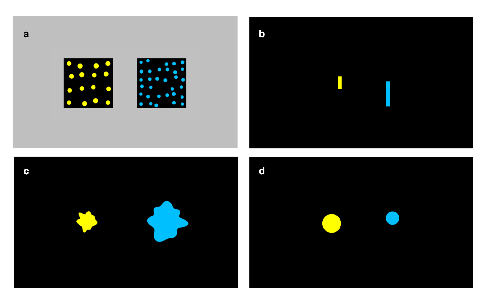
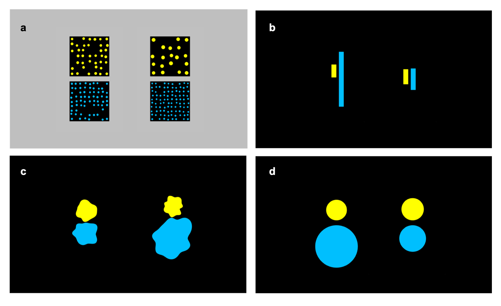
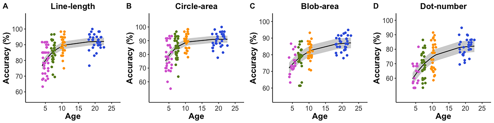
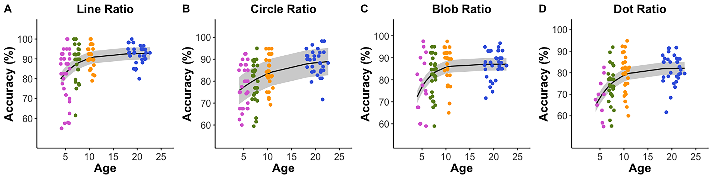
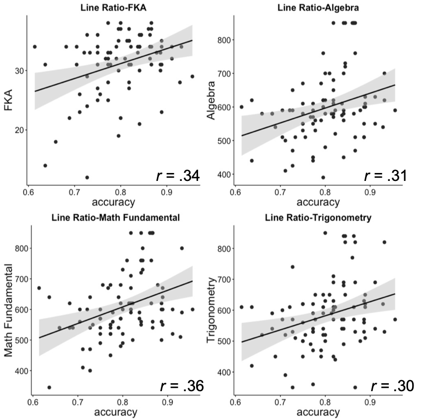
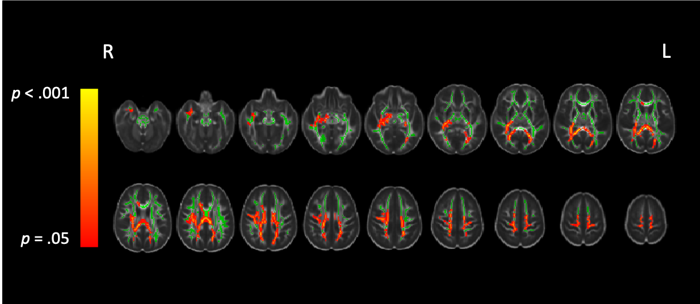
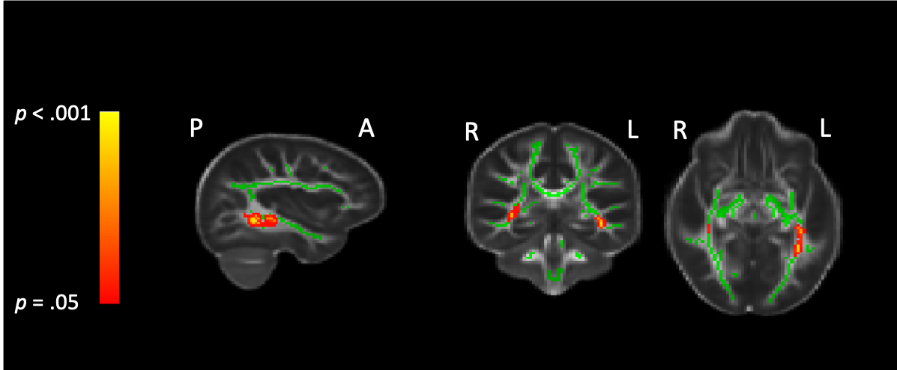
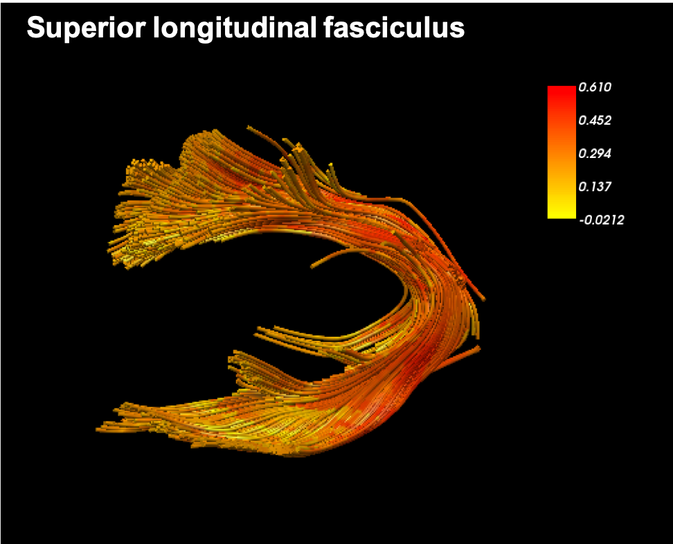
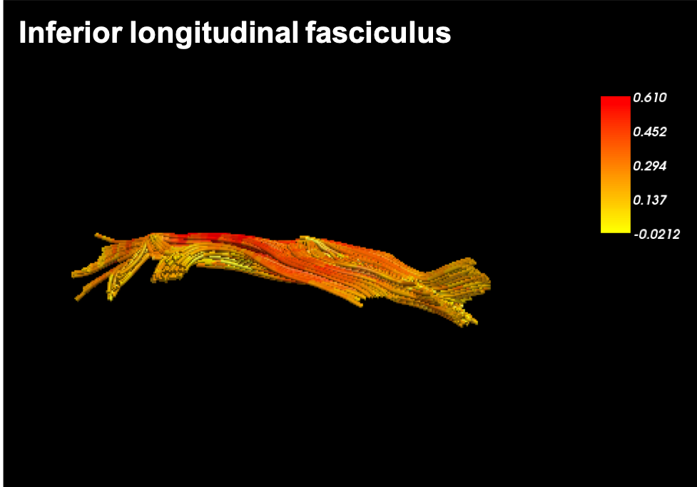
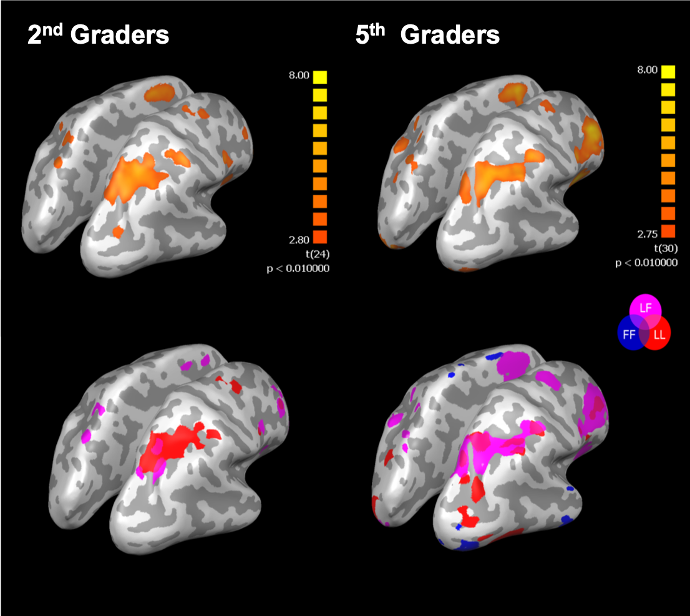

---
output:
  html_document:
    theme: cosmo
    highlight: textmate
    toc: yes
    toc_float: true
---

### **Project Overview** 
   Matthews, Lewis and Hubbard (2016) leveled a challenge against the prevailing theory that fractions – as opposed to whole numbers – are not grounded in a primitive nonsymbolic number sense (see also Jacob, Vallentin & Nieder, 2012; Lewis, Matthews, Lewis & Hubbard, 2016; Sidney, Thompson, Matthews & Hubbard, 2017). This account holds that humans possess a nonsymbolic ratio processing system (RPS) that confers the ability to process nonysmbolic ratio magnitudes (e.g., ratios instantiated by juxtaposing two line segments). It further argues that the RPS may provide a perceptual route that can expand cognitive primitive accounts of numerical cognition to apply to fractions – and perhaps to all real numbers.

### **Behavioral** 

#### **Development of simple and ratio magnitudes representations **, *Developmental Science, in press*
  Even though the RPS theory has proposed, we don't know yet if the RPS is independent or dependent on the processings for extensive magnitudes (or simple magnitudes). We examined the development of simple and relational magnitudes discriminations and how these discriminabilities are related among preschoolers, 2nd graders, 5th graders and adults. 

  
   Figure 1. The example of stimuli for the simple (left) and ratio (right) magnitude comparison task. 

  
   Figure 2. The developmental trajectories of simple (upper) and ratio (lower) magnitude discrimination acuities. 

#### **The relations between ratio magnitude representations and higher mathematical abilities**, *Journal of Numerical Cognition, registered report currently under review*

 

Matthews, Lewis and Hubbard (2016) found significant positive relations between ratio processing ability and symbolic numerical measures, including fractions knowledge and algebra skill measured at college entry. We similarly had college students complete three nonsymblic ratio discrimination tasks along with three simple magnitude comparison tasks in corresponding formats that served as controls. We used three different formats: lines, circle and dots. 

Consistent with Matthews et al., we found that RPS acuity predicted fractions knowledge and all three entrance exam math subtests over simple magnitude acuities and inhibitory control. However, we further found that the predictive power of the composite RPS measure stemmed only from acuity on the line-ratio comparison task, and that predictive power was somewhat attenuated with the inclusion of fluid intelligence. 

  
   Figure 3. Correlations between the line-ratio representation and Math achievements 

---
---

### **Diffusion MRI** 

#### **Cross-sectional research in 2nd and 5th graders**
 We are currently conducting a large cross-sectional and longitudinal study using neural and behavioral measures to explore the development of the ratio processing system (RPS).

Diffusion MRI allow us to reconstruct white matter connections in our brain. In particular, by using Diffusion Tensor Imaging (DTI), I'm interested in the relations between the structural connectivity and cognitive performance. Our recent work on 2nd and 5th graders' found that only 5th graders fraction processing ability is related with fractional anistropy in the part of the longitudinal fasciculus (ILF). 

  Figure 4. Tract-based spatial statistics (TBSS) results showing the difference in FA between 2nd and 5th graders. 

  Figure 5. Tract-based spatial statistics (TBSS) results showing the correlation between FA and fraction processing ability while age in months, gender, and movements are controlled for. 

   As a follow-up, we also performed a deterministic tractography especially for the superior longitudinal fasiculus (SLF) and the inferior longitudinal fasciulus (ILF) 

---
---
### **funtional MRI** 

#### **Cross-sectional research in 2nd and 5th graders**
 Using functional MRI,  my particular focus is investigating differences in how children process nonsymbolic and symbolic ratio magnitudes in the brain prior to (2nd grade) and after (5th grade) receiving instruction with symbolic fractions. In the scanner, children decided which of two nonsymbolic ratios or symbolic fractions was numerically larger (ratio comparison). Standard GLM analyses showed that 2nd and 5th graders recruited parietal regions (especially the right Intraparietal sulcus) for nonsymbolic ratios, but only 5th graders recruited frontoparietal areas for symbolic fractions.  

 

  Figure 8. (upper) The neural distance effect collapsing across all notations in 2nd (left) and 5th graders (right) (p<.01, cluster corrected). 5th graders showed larger bilateral activations in the parietal and the prefrontal areas compared to 2nd graders. (lower) The neural distance effect in each notation in 2nd and 5th graders (p<.01, cluster corrected). 5th graders showed larger overlaps among notation conditions in both parietal and prefrontal areas, whereas 2nd graders’ distance effect was mostly from the non-symbolic notation.  

